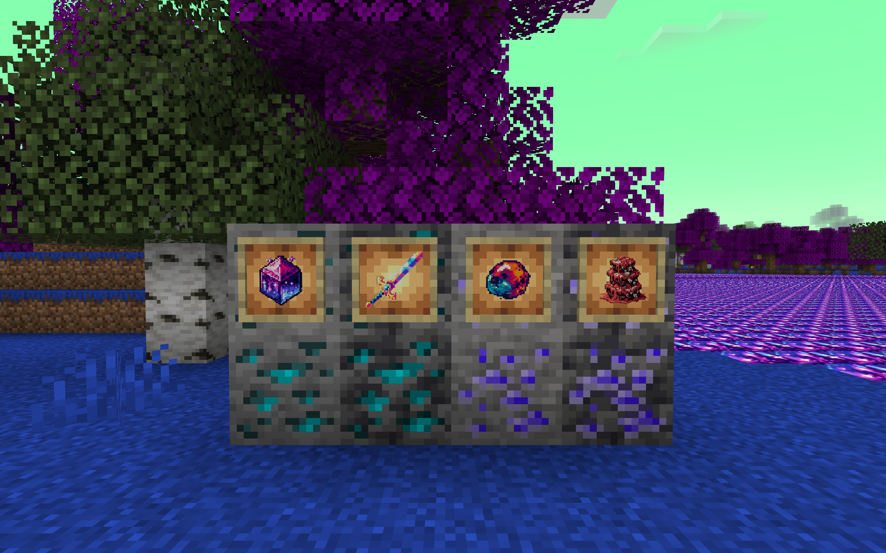

以下是韩语版本的 README 文件：

# Fabric을 사용한 Minecraft 모드

## 언어 선택

- [English](README.md)
- [简体中文 (Simplified Chinese)](README_ZH.md)
- [繁體中文 (Traditional Chinese)](README_TW.md)
- [Français (French)](README_FR.md)
- [日本語 (Japanese)](README_JA.md)
- [Español (Spanish)](README_ES.md)
- [한국어 (Korean)](README_KO.md)

## Lanthanum 모드에 대해

Lanthanum 모드에 오신 것을 환영합니다! 이 모드는 중국 한자 "镧"에 대한 저의 애정에서 영감을 받았습니다.

### 왜 이 모드를 만들었나요?

이 모드를 만든 이유는 처음에는 단순히 중국 한자 "镧"을 좋아해서 시작되었습니다.  
"澜"은 게임 《왕자영요》의 캐릭터입니다.  
이후 [**IndustrialCraft2**](https://www.curseforge.com/minecraft/mc-mods/industrial-craft)와 [**Mekanism**](https://www.curseforge.com/minecraft/mc-mods/mekanism)에 대한 애정도 포함되었습니다.

## Lanthanum 모드 - 모드 개요

- **새로운 차원**: 이 모드는 새로운 차원 #14를 도입하며, 이 차원에는 강과 바다가 완전히 제거되고, 대신에 란탄 광석으로 가득 차 있습니다.

- **새로운 광물과 무기**: 란탄 광석과 보석 광석, 이들의 다양한 파생 제품과 무기가 추가되었습니다. 이들은 모두 매우 강력합니다.

- **란탄 세계 포탈**: 이 모드에는 란탄으로 만든 포탈 프레임이 추가되어 포탈을 제작할 수 있습니다. 이제 포탈 프레임과 물을 사용하여 지옥 포탈과 유사한 포탈을 만들 수 있습니다.

- **에너지 시스템**: 이 모드는 RebornCore 모드와 매끄럽게 통합되어 강력한 에너지 시스템을 도입합니다. 이 모드의 잠재력을 최대한 발휘하려면, [**Reborn Core**](https://www.curseforge.com/minecraft/mc-mods/reborncore)가 필수적인 선행 조건입니다.

- **호환 모드**: RebornCore가 안정적인 에너지 프레임을 제공하기 때문에 [**TechReborn**](https://www.curseforge.com/minecraft/mc-mods/techreborn) 모드의 발전기 및 에너지 전송 메커니즘과 호환됩니다.

- **정제기 기능**: 정제기는 란탄과 보석 광석의 2배 산출을 가능하게 합니다. 이제 레드스톤을 통해 정제기에 지속적으로 에너지를 공급하거나 다른 호환 모드에서 제공하는 발전기를 사용할 수 있어, 더 유연하고 효율적인 정제 과정이 가능합니다.

Lanthanum 모드는 훌륭한 기술 모드입니다. 피드백, 제안 또는 기여자로의 신청을 통해 이 프로젝트를 개선하고 기여해 주시기 바랍니다.

## Lanthanum 모드 - 목표

- **더 많은 광물**: Lanthanum은 향후 광물의 64배 산출을 제공할 계획입니다. 이는 다소 미친 생각처럼 들릴 수 있지만, 더 많은 에너지가 필요합니다.

## Lanthanum 모드 - 의존성 및 연동

### 의존성
- [**Reborn Core**](https://www.curseforge.com/minecraft/mc-mods/reborncore): 이 모드는 RebornCore 모드와 매끄럽게 통합되어 강력한 에너지 시스템을 도입합니다.

### 연동
- [**TechReborn**](https://www.curseforge.com/minecraft/mc-mods/techreborn): 이 모드는 TechReborn 모드와 호환되며, TechReborn 모드의 발전기와 에너지 전송 메커니즘과 호환됩니다.

## 기여

이 프로젝트에 기여해 주셔서 감사합니다. 개발 프로세스의 원활하고 효율적인 진행을 위해 다음의 기여 지침을 따르시기 바랍니다:

- **버그 리포트**: 버그를 발견하셨다면, 명확한 문제 설명, 재현 단계 및 예상 동작을 포함한 문제 리포트를 제출해 주십시오.

- **기능 요청**: 새 기능이나 개선 사항이 있다면, 문제 리포트를 제출하여 논의해 주십시오.

- **풀 리퀘스트**: 버그 수정이나 새 기능 추가를 위해 풀 리퀘스트를 제출해 주시기 바랍니다. 풀 리퀘스트 제출 시 다음 사항을 기억해 주십시오:
  - 코드가 우리의 코딩 표준을 준수하는지 확인해 주십시오.
  - 명확하고 간결한 변경 설명을 제공해 주십시오.
  - 관련 테스트가 포함된 경우, 이를 포함해 주십시오.
  - `gradle.properties` 파일을 변경하지 마십시오.
  - 메인 브랜치와 Alpha 브랜치를 직접 변경하지 마십시오.

### 브랜치 워크플로우

  기여를 위해 협력자는 우리의 브랜치 워크플로우를 따라야 합니다:
    1. 기여를 위해 새로운 브랜치를 생성하십시오.
    2. 브랜치에 설명적인 이름을 붙이십시오.
    3. 브랜치에서 변경 작업을 진행하십시오.
    4. `feature` 브랜치에 병합을 위한 풀 리퀘스트를 제출하십시오.
    5. 승인과 필요한 테스트를 통과한 후, 변경 사항이 병합됩니다.

이 프로젝트에 기여함으로써, 귀하는 MIT 라이선스에 따라 귀하의 코드를 라이선스화하는 데 동의하는 것입니다.

## 개발 표준

코드 품질과 일관성을 유지하기 위해, 다음의 개발 표준을 따르십시오:
- 기존의 코딩 스타일 지침을 준수하십시오.
- 명확하고 간결한 코드 주석을 작성하십시오.
- 필요한 경우, 코드를 문서화하십시오.
- 변경 사항을 철저히 테스트하십시오.

## 라이선스

이 프로젝트는 MIT 라이선스에 따라 라이선스가 부여됩니다 - 자세한 내용은 [LICENSE](LICENSE) 파일을 참조해 주십시오.